# **Demoblaze Python Final Project**

## **Overview**

This project focuses on **automated testing** for the **Demoblaze** website using **Python** and **Selenium**, with additional support for manual testing via **Excel**. The objective is to ensure a seamless user experience and validate the website's performance throughout its development lifecycle.

## **Project Description**

Demoblaze is dedicated to performance validation at every stage of the software development cycle. Their open-source compatible platform allows for comprehensive testing processes.

### **Key Features of the Demoblaze Website:**

- **User Authentication:** Users log in with a username and password.

- **Product Categories:** The site includes three main categories: **Phones**, **Laptops**, and **Monitors**, each offering a variety of products.

- Shopping Experience:

   After logging in, users can:

  - Browse products
  - Add items to their cart
  - Complete an order form
  - Finalize purchases

### **Core Technologies**

- **Python:** The programming language used for automation.
- **Selenium:** A powerful tool for automating web browsers.
- **Pytest:** A testing framework that facilitates the creation and execution of test cases.
- **Allure:** A reporting tool that generates clear and informative test reports.
- **Webdriver-manager:** Simplifies the management of browser drivers for Selenium.
- **Requests:** A library for making HTTP requests, useful for API testing.
- **Excel:** Utilized for manual testing and tracking test cases.

## **Project Structure**

The project is organized into two main directories:

- **WEB** (containing 5 subdirectories)
- **API** (containing 2 subdirectories)

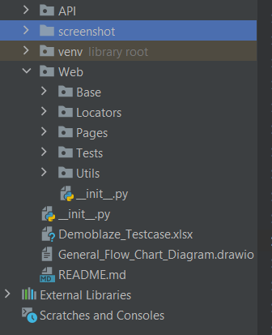


## Diagram 

* The General Flow Chart Diagram for the Overall Project
  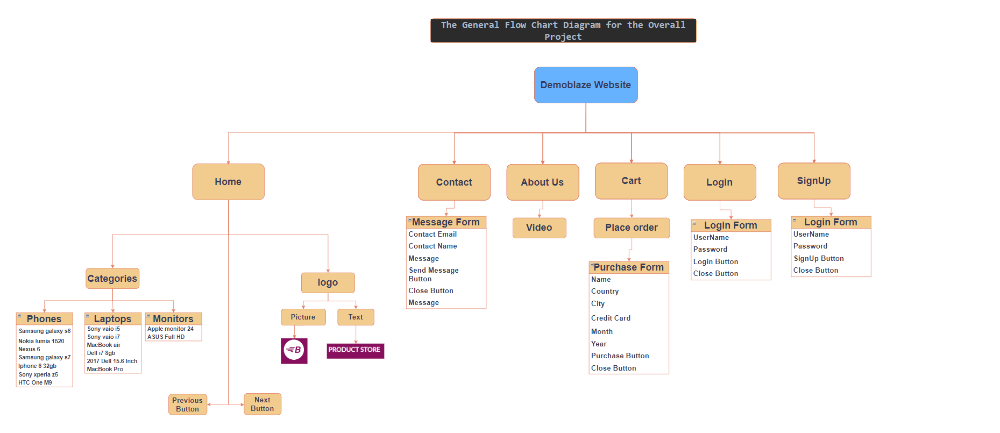


## 📸 Screen-shot 

**Welcome Page ** 

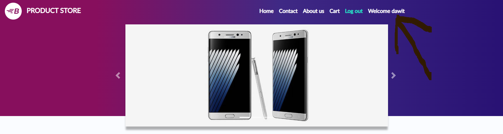


**Homepage**

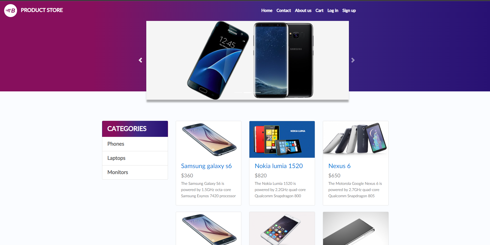


**Sign Up Page** 

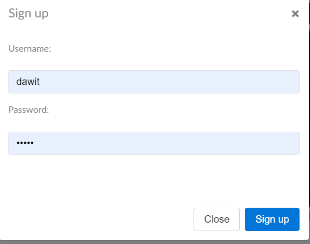


**Log In Page** 

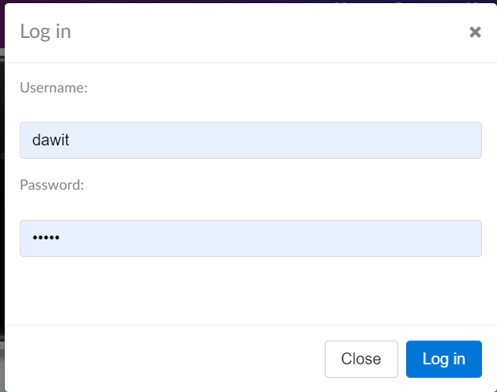

**Contact Page** 

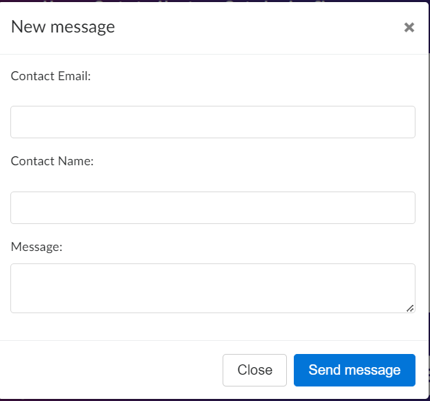


**Product Page**

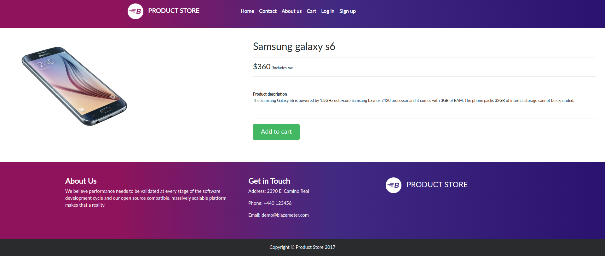


**Cart Page** 

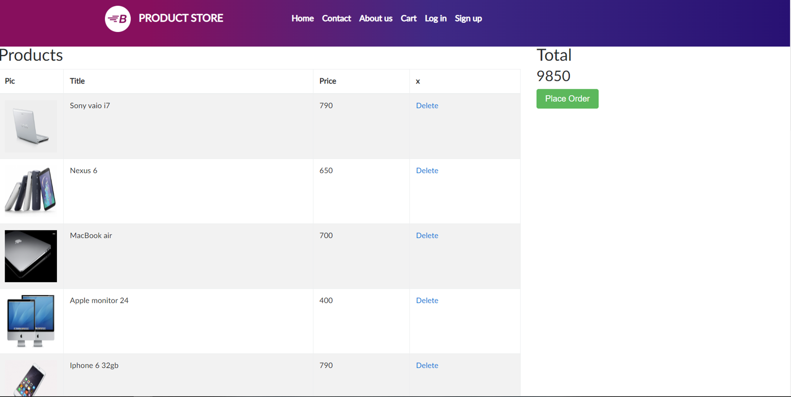


**Place Order page**  


**Confirmation page** 

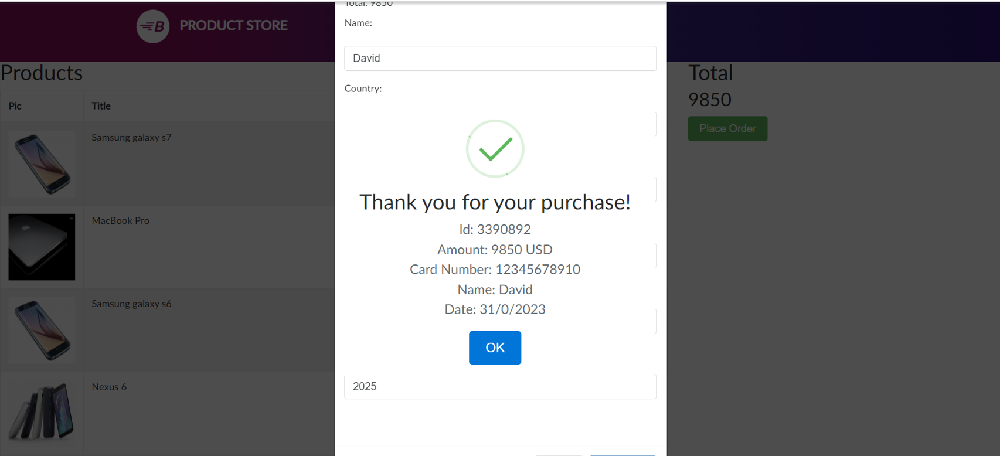


**Allure Report** 

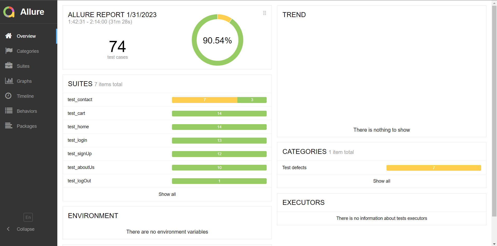


## **How to Run the Tests**

To execute the tests for the Demoblaze website, follow these steps:

1. Open **PyCharm Community Edition/Vscode**.

2. Open the terminal within **PyCharm/Vscode.**

3. Navigate to the directory containing your tests:

   ```bash
   cd path/to/your/tests
   ```

4. Run tests in a module using:

   ```bash
   pytest test_mod.py
   ```

5. To enable Allure listener for collecting results during test execution:

   ```bash
   pytest --alluredir=/tmp/my_allure_results
   ```

6. To view the actual report after tests finish, use Allure command-line utility:

   ```bash
   allure serve /tmp/my_allure_results
   ```

## Thank you for your interest in this project! 🙌

Feel free to adjust any sections or add additional details based on your project's specific requirements or features!
